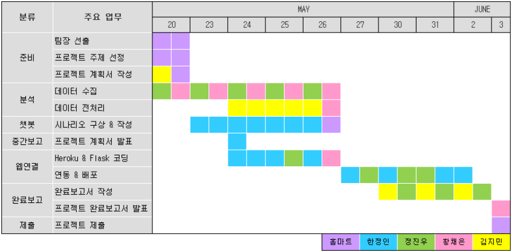

# 공공 주택 정보 알림 챗봇 - “홈마트”

---

- **카카오 챗봇 링크** : [http://pf.kakao.com/_xgiMxcb](http://pf.kakao.com/_xgiMxcb)
- **인원** : 4명
- **기간** : 2022.05.20 ~ 2022.06.03
- **사용 언어** : ```Python```
- **사용 라이브러리**
  - ```pandas 1.3.4```
  - ```selenium 4.1.5```
  - ```chromedriver```
  - ```chromedriver_autoinstaller 0.3.1```
  - ```flask 1.1.2```
  - ```request```
  - ```json```, ```jsonify```
- **작업 툴**
    - `Flask`
    - `Kakao i open builder`
    - `HEROKU`
    - `GitHub`
    - `VScode`
    - `goormIDE`

## 프로젝트 목적

---

- 공공 임대 주택의 정보를 간편하게 알 수 있게 한다.
- 공공 임대 주택의 진행 중인 공고 사항들을 알 수 있게 한다.
- 필요시 링크를 통해 페이지에 접속이 가능해야 한다.

## 팀원 및 역할 분담

---

- 팀원 : 한정인, 정진우, 황채은, 김지민
- 한정인 - 팀장
    - 자료 수집
    - 시나리오 구성
    - 스킬서버구축
- 정진우
    - 자료 수집
    - 웹크롤링
    - 스킬서버구축
    - 완료보고서 작성
- 황채은
    - 자료 수집
    - 웹크롤링
    - 데이터 전처리
- 김지민
    - 자료 수집
    - 데이터 전처리
    - 계획/완료 보고서 작성

## 프로젝트 수행 과정

---

- 전체 수행 기간 : 2022.05.20 ~ 2022.06.03



## 기능 흐름도

---


## 한계점 및 시행착오

---

- **한계점**
    - 마이홈에서 실시간 정보를 가져오지 못함
    - 알림 서비스 미구현
    - 관련 뉴스 출력 기능 미구현
- **시행착오**
    - Github와 HEROKU **연결 에러로 배포 안됨**
        - 연결할 때 **연동과 배포의 순서의 문제로 발생**, 순서를 **재설정하여 해결**
        - 만일을 대비해 **goormIDE로 개발 병행**, 다양한 시도가 가능해짐
    - 새로운 정보로 인해 **웹크롤링 순서에 오류 발생**
        - 각 지역 **상위 10곳만 크롤링**하여 문제 해결
    - 카카오톡 응답 메시지의 형식에 정보를 그대로 넣어 출력하면, 프로그램의 관리가 어려워짐
        - 응답 메시지의 기본 포멧을 정의하고, 포멧 내부의 리스트에 삽입하는 방법을 적용하여 해결
    - 프로그램 소스코드가 길어져 **유지보수가 어려워짐**
        - 기능별 모듈화를 시도하며 코드 간소화 작업를 진행하여 해결

## 향후 계획

---

- 미구현된 기능들을 구현
- 지속적인 코드 관리로 효율적인 진행이 가능하도록 한다.

## 결과 자료

---

[부동산2팀 홈마트 결과 보고서](pdf/부동산2팀_홈마트_결과.pdf)

[시연영상 Google Drive](https://drive.google.com/file/d/1gKNMv2iAT_wnokF22wmM6YORYsIRBpHn/view?usp=sharing)
